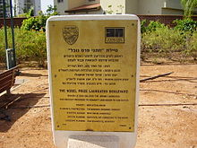

 <h2 id="firstHeading" class="firstHeading" lang="en">List of Jewish Nobel laureates</h2>

&nbsp;

&nbsp;

Sign on Nobel Laureates Boulevard in&nbsp;<a title="Rishon LeZion" href="https://en.wikipedia.org/wiki/Rishon_LeZion">Rishon LeZion</a>&nbsp;saluting Jewish Nobel laureates

&nbsp;

<a title="Nobel Prize" href="https://en.wikipedia.org/wiki/Nobel_Prize">Nobel Prizes</a>&nbsp;have been awarded to over 900 individuals,&nbsp;of whom at least 20% were&nbsp;<a title="Jews" href="https://en.wikipedia.org/wiki/Jews">Jews</a>&nbsp;although the&nbsp;<a class="mw-redirect" title="Jewish population" href="https://en.wikipedia.org/wiki/Jewish_population">Jewish population</a>&nbsp;comprises less than 0.2% of the&nbsp;<a class="mw-redirect" title="World's population" href="https://en.wikipedia.org/wiki/World%27s_population">world's population</a>.&nbsp;Various theories have been proposed to explain this phenomenon, which has received considerable attention.&nbsp;Israeli academics Dr. Elay Ben-Gal and Professor&nbsp;<a title="Yeshayahu Leibowitz" href="https://en.wikipedia.org/wiki/Yeshayahu_Leibowitz">Yeshayahu Leibowitz</a>, curious about the phenomenon, started to form an encyclopedia of Jewish Nobel laureates and interview as many as possible about their life and work.

Jews have been recipients of all six awards. The first Jewish recipient,&nbsp;<a title="Adolf von Baeyer" href="https://en.wikipedia.org/wiki/Adolf_von_Baeyer">Adolf von Baeyer</a>, was awarded the prize in Chemistry in 1905. As of 2019, the most recent Jewish recipient was economics laureate&nbsp;<a title="Michael Kremer" href="https://en.wikipedia.org/wiki/Michael_Kremer">Michael Kremer</a>.

Jewish laureates&nbsp;<a title="Elie Wiesel" href="https://en.wikipedia.org/wiki/Elie_Wiesel">Elie Wiesel</a>&nbsp;and&nbsp;<a title="Imre Kert&eacute;sz" href="https://en.wikipedia.org/wiki/Imre_Kert%C3%A9sz">Imre Kert&eacute;sz</a>&nbsp;survived the&nbsp;<a title="Extermination camp" href="https://en.wikipedia.org/wiki/Extermination_camp">extermination camps</a>&nbsp;during&nbsp;<a title="The Holocaust" href="https://en.wikipedia.org/wiki/The_Holocaust">the Holocaust</a>,&nbsp;while&nbsp;<a title="Fran&ccedil;ois Englert" href="https://en.wikipedia.org/wiki/Fran%C3%A7ois_Englert">Fran&ccedil;ois Englert</a>&nbsp;survived by being hidden in orphanages and children's homes.&nbsp;Others, such as&nbsp;<a title="Walter Kohn" href="https://en.wikipedia.org/wiki/Walter_Kohn">Walter Kohn</a>,&nbsp;<a title="Otto Stern" href="https://en.wikipedia.org/wiki/Otto_Stern">Otto Stern</a>,&nbsp;<a title="Albert Einstein" href="https://en.wikipedia.org/wiki/Albert_Einstein">Albert Einstein</a>,&nbsp;<a title="Hans Adolf Krebs" href="https://en.wikipedia.org/wiki/Hans_Adolf_Krebs">Hans Krebs</a>&nbsp;and&nbsp;<a title="Martin Karplus" href="https://en.wikipedia.org/wiki/Martin_Karplus">Martin Karplus</a>&nbsp;had to flee&nbsp;<a title="Nazi Germany" href="https://en.wikipedia.org/wiki/Nazi_Germany">Nazi Germany</a>&nbsp;to avoid persecution.&nbsp;Still others, including&nbsp;<a title="Rita Levi-Montalcini" href="https://en.wikipedia.org/wiki/Rita_Levi-Montalcini">Rita Levi-Montalcini</a>,&nbsp;<a class="mw-redirect" title="Herbert Hauptman" href="https://en.wikipedia.org/wiki/Herbert_Hauptman">Herbert Hauptman</a>,&nbsp;<a class="mw-redirect" title="Robert Furchgott" href="https://en.wikipedia.org/wiki/Robert_Furchgott">Robert Furchgott</a>,&nbsp;<a title="Arthur Kornberg" href="https://en.wikipedia.org/wiki/Arthur_Kornberg">Arthur Kornberg</a>, and&nbsp;<a title="Jerome Karle" href="https://en.wikipedia.org/wiki/Jerome_Karle">Jerome Karle</a>&nbsp;experienced significant&nbsp;<a title="Antisemitism" href="https://en.wikipedia.org/wiki/Antisemitism">antisemitism</a>&nbsp;in their careers.

<a title="Arthur Ashkin" href="https://en.wikipedia.org/wiki/Arthur_Ashkin">Arthur Ashkin</a>, a 96-year-old American Jew was, at the time of his award, the oldest person to receive a Nobel Prize.

  
 
 <h2> </h2>
 

 1.  <a href="https://en.wikipedia.org/wiki/Robert_Aumann" target="_blank" style="text-decoration:none">  
 <b>Robert John Aumann</b>
 </a> 
<a href="https://github.com/manjunath5496/Jewish-Nobel-Lectures/blob/master/jwn(1).pdf" target="_blank" style="text-decoration:none">  
 War and Peace
 </a> 
                
2. <a href="https://en.wikipedia.org/wiki/Hans_Bethe" target="_blank" style="text-decoration:none">  
 <b>Hans Albrecht Bethe</b>
 </a> 
               <a href="https://github.com/manjunath5496/Jewish-Nobel-Lectures/blob/master/jwn(2).pdf" target="_blank" style="text-decoration:none">  
 Energy Production in Stars
 </a> 
                
 3.  <a href="https://en.wikipedia.org/wiki/Konrad_Emil_Bloch" target="_blank" style="text-decoration:none">  
 <b>Konrad Emil Bloch</b>
 </a> 
<a href="https://github.com/manjunath5496/Jewish-Nobel-Lectures/blob/master/jwn(3).pdf" target="_blank" style="text-decoration:none">  
 The biological synthesis of cholesterol
 </a> 
                
4. <a href="https://en.wikipedia.org/wiki/Felix_Bloch" target="_blank" style="text-decoration:none">  
<b> Felix Bloch</b>
 </a> 
               <a href="https://github.com/manjunath5496/Jewish-Nobel-Lectures/blob/master/jwn(4).pdf" target="_blank" style="text-decoration:none">  
 The Principle of Nuclear Induction
 </a> 
 

5.  <a href="https://en.wikipedia.org/wiki/Niels_Bohr" target="_blank" style="text-decoration:none">  
 <b>Niels Henrik David Bohr</b>
 </a> 
<a href="https://github.com/manjunath5496/Jewish-Nobel-Lectures/blob/master/jwn(5).pdf" target="_blank" style="text-decoration:none">  
The structure of the atom
 </a> 
                
6. <a href="https://en.wikipedia.org/wiki/Max_Born" target="_blank" style="text-decoration:none">  
 <b>Max Born</b>
 </a> 
               <a href="https://github.com/manjunath5496/Jewish-Nobel-Lectures/blob/master/jwn(6).pdf" target="_blank" style="text-decoration:none">  
 The Statistical Interpretations of Quantum Mechanics
 </a> 
                
 7.  <a href="https://en.wikipedia.org/wiki/Ernst_Chain" target="_blank" style="text-decoration:none">  
 <b>Sir Ernst Boris Chain</b>
 </a> 
<a href="https://github.com/manjunath5496/Jewish-Nobel-Lectures/blob/master/jwn(7).pdf" target="_blank" style="text-decoration:none">  
The chemical structure of the penicillins
 </a> 
                
8. <a href="https://en.wikipedia.org/wiki/Albert_Einstein" target="_blank" style="text-decoration:none">  
<b> Albert Einstein</b>
 </a> 
               <a href="https://github.com/manjunath5496/Jewish-Nobel-Lectures/blob/master/jwn(8).pdf" target="_blank" style="text-decoration:none">  
 Fundamental ideas and problems of the theory of relativity
 </a> 
               
 9.  <a href="https://en.wikipedia.org/wiki/Richard_Feynman" target="_blank" style="text-decoration:none">  
 <b>Richard Phillips "Dick" Feynman</b>
 </a> 
<a href="https://github.com/manjunath5496/Jewish-Nobel-Lectures/blob/master/jwn(9).pdf" target="_blank" style="text-decoration:none">  
 The development of the space-time view of quantum electrodynamics
 </a> 
                
10. <a href="https://en.wikipedia.org/wiki/James_Franck" target="_blank" style="text-decoration:none">  
 <b>James Franck</b>
 </a> 
               <a href="https://github.com/manjunath5496/Jewish-Nobel-Lectures/blob/master/jwn(10).pdf" target="_blank" style="text-decoration:none">  
 Transformations of kinetic energy of free electrons into excitation energy of atoms by impacts
 </a> 
                
 11.  <a href="https://en.wikipedia.org/wiki/Vitaly_Ginzburg" target="_blank" style="text-decoration:none">  
 <b>Vitaly Ginzburg</b>
 </a> 
<a href="https://github.com/manjunath5496/Jewish-Nobel-Lectures/blob/master/jwn(11).pdf" target="_blank" style="text-decoration:none">  
On Superconductivity and Superfluidity
 </a> 
                
12. <a href="https://en.wikipedia.org/wiki/Fritz_Haber" target="_blank" style="text-decoration:none">  
<b> Fritz Haber </b>
 </a> 
               <a href="https://github.com/manjunath5496/Jewish-Nobel-Lectures/blob/master/jwn(12).pdf" target="_blank" style="text-decoration:none">  
 The synthesis of ammonia from its elements
 </a> 
 

13.  <a href="https://en.wikipedia.org/wiki/Bernard_Katz" target="_blank" style="text-decoration:none">  
 <b>Bernard Katz</b>
 </a> 
<a href="https://github.com/manjunath5496/Jewish-Nobel-Lectures/blob/master/jwn(13).pdf" target="_blank" style="text-decoration:none">  
On the quantal mechanism of neural transmitter release
 </a> 
                
14. <a href="https://en.wikipedia.org/wiki/Fritz_Albert_Lipmann" target="_blank" style="text-decoration:none">  
 <b>Fritz Albert Lipmann </b>
 </a> 
               <a href="https://github.com/manjunath5496/Jewish-Nobel-Lectures/blob/master/jwn(14).pdf" target="_blank" style="text-decoration:none">  
 Development of the acetylation problem: a personal account
 </a> 
                
 15.  <a href="https://en.wikipedia.org/wiki/Otto_Fritz_Meyerhof" target="_blank" style="text-decoration:none">  
 <b>Otto Fritz Meyerhof </b>
 </a> 
<a href="https://github.com/manjunath5496/Jewish-Nobel-Lectures/blob/master/jwn(15).pdf" target="_blank" style="text-decoration:none">  
Energy conversions in muscle
 </a> 
                
16. <a href="https://en.wikipedia.org/wiki/Albert_A._Michelson" target="_blank" style="text-decoration:none">  
<b>Albert A. Michelson</b>
 </a> 
               <a href="https://github.com/manjunath5496/Jewish-Nobel-Lectures/blob/master/jwn(16).pdf" target="_blank" style="text-decoration:none">  
 Recent advances in spectroscopy
 </a> 
               
17. <a href="https://en.wikipedia.org/wiki/Paul_Ehrlich" target="_blank" style="text-decoration:none">  
<b> Paul Ehrlich</b>
 </a> 
               <a href="https://github.com/manjunath5496/Jewish-Nobel-Lectures/blob/master/jwn(17).pdf" target="_blank" style="text-decoration:none">  
 Partial cell functions
 </a> 
               
 18.  <a href="https://en.wikipedia.org/wiki/Wolfgang_Pauli" target="_blank" style="text-decoration:none">  
 <b>Wolfgang Ernst Pauli</b>
 </a> 
<a href="https://github.com/manjunath5496/Jewish-Nobel-Lectures/blob/master/jwn(18).pdf" target="_blank" style="text-decoration:none">  
 Exclusion principle and quantum mechanics
 </a> 
                
19. <a href="https://en.wikipedia.org/wiki/Otto_Stern" target="_blank" style="text-decoration:none">  
 <b>Otto Stern</b>
 </a> 
               <a href="https://github.com/manjunath5496/Jewish-Nobel-Lectures/blob/master/jwn(19).pdf" target="_blank" style="text-decoration:none">  
 The method of molecular rays
 </a> 
                
 20.  <a href="https://en.wikipedia.org/wiki/Eugene_Wigner" target="_blank" style="text-decoration:none">  
 <b>Eugene Wigner</b>
 </a> 
<a href="https://github.com/manjunath5496/Jewish-Nobel-Lectures/blob/master/jwn(20).pdf" target="_blank" style="text-decoration:none">  
Events, Laws of Nature, and Invariance Principles
 </a> 
                
21. <a href="https://en.wikipedia.org/wiki/Richard_Willst%C3%A4tter" target="_blank" style="text-decoration:none">  
<b> Richard Martin Willstätter</b>
 </a> 
               <a href="https://github.com/manjunath5496/Jewish-Nobel-Lectures/blob/master/jwn(21).pdf" target="_blank" style="text-decoration:none">  
 On plant pigments
 </a> 
 

22.  <a href="https://en.wikipedia.org/wiki/Julius_Axelrod" target="_blank" style="text-decoration:none">  
 <b>Julius Axelrod</b>
 </a> 
<a href="https://github.com/manjunath5496/Jewish-Nobel-Lectures/blob/master/jwn(22).pdf" target="_blank" style="text-decoration:none">  
Noradrenaline: fate and control of its biosynthesis
 </a> 
                
23. <a href="https://en.wikipedia.org/wiki/Gerty_Cori" target="_blank" style="text-decoration:none">  
 <b>Gerty Theresa Cori  </b>
 </a> 
               <a href="https://github.com/manjunath5496/Jewish-Nobel-Lectures/blob/master/jwn(23).pdf" target="_blank" style="text-decoration:none">  
 Polysaccharide phosphorylase
 </a> 
                
 24.  <a href="https://en.wikipedia.org/wiki/George_de_Hevesy" target="_blank" style="text-decoration:none">  
 <b>George de Hevesy</b>
 </a> 
<a href="https://github.com/manjunath5496/Jewish-Nobel-Lectures/blob/master/jwn(24).pdf" target="_blank" style="text-decoration:none">  
Some applications of isotopic indicators
 </a> 
                
25. <a href="https://en.wikipedia.org/wiki/Rita_Levi-Montalcini" target="_blank" style="text-decoration:none">  
<b>Rita Levi-Montalcini</b>
 </a> 
               <a href="https://github.com/manjunath5496/Jewish-Nobel-Lectures/blob/master/jwn(25).pdf" target="_blank" style="text-decoration:none">  
 The nerve growth factor: thirty-five years later
 </a>                              
 26. <a href="https://en.wikipedia.org/wiki/Emilio_Segr%C3%A8" target="_blank" style="text-decoration:none">  
 <b>Emilio Gino Segrè  </b>
 </a> 
               <a href="https://github.com/manjunath5496/Jewish-Nobel-Lectures/blob/master/jwn(26).pdf" target="_blank" style="text-decoration:none">  
 Properties of antinucleons
 </a> 
                
 27.  <a href="https://en.wikipedia.org/wiki/Selman_Waksman" target="_blank" style="text-decoration:none">  
 <b>Selman Abraham Waksman </b>
 </a> 
<a href="https://github.com/manjunath5496/Jewish-Nobel-Lectures/blob/master/jwn(27).pdf" target="_blank" style="text-decoration:none">  
Streptomycin: background, isolation, properties, and utilization
 </a> 
                
28. <a href="https://en.wikipedia.org/wiki/Otto_Wallach" target="_blank" style="text-decoration:none">  
<b>Otto Wallach</b>
 </a> 
               <a href="https://github.com/manjunath5496/Jewish-Nobel-Lectures/blob/master/jwn(28).pdf" target="_blank" style="text-decoration:none">  
 Alicyclic compounds
 </a>              
               
               
